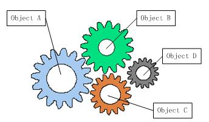
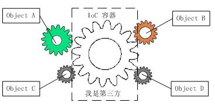

# 控制反转和依赖注入

### 什么是控制反转

在开发过程中必定会存在一个类依赖另一个类的情况，随着系统的开发，这种依赖会变得越来越复杂，导致的结果就是修改其中一个模块，就会导致其他模块的修改，整个系统难以维护



就像上图的齿轮关系一样，各个齿轮之间相互依赖，修改其中一个可能会影响到其他齿轮

解决办法就是通过“第三方”来管理这些模块之间的依赖,这个"第三方"一般叫做容器，用来动态提供依赖的具体对象



如图，第三方作为一个中间人，将各部分连接起来，这时各个模块之间没有直接依赖，他们只是通过第三方来协同工作，自身的修改并不会直接影响到其他模块，实现了模块与模块之间的解耦

上面就是控制反转的思想，为什么叫控制反转呢？

首先在未引入第三方模块之前，一个a类依赖与b类，需要在a类的内部实例化b类，这个实例化类的控制权在a类本身

在引入第三方模块之后，a类的实例化以及它所依赖的b类的实例化，完全交给第三方模块来做，这样控制权交给了第三方

这就是控制反转名称的由来，控制反转只是一种设计思想

### 什么是依赖注入

依赖注入就是控制反转的应用，在系统中，一个模块向外部暴露的仅仅是接口，容器通过暴露的接口找到具体的实现，这样来使各个模块协同工作

#### 依赖注入的方式

* 构造函数注入

```csharp
public class Test{
    private readonly ISummaryService _service
    public Test(ISummaryService service)
    {
        _service=service;
    }
}
```

* 属性注入

```csharp
public class Foo
   {
       public IBar Bar{get; set;}
    
       [Injection]
       public IBaz Baz {get; set;}
   }
```

* 方法注入

```csharp
  public class Foo
  {
      public IBar Bar{get; private set;}
      
      [Injection]
      public Initialize(IBar bar)
      {
          this.Bar = bar;
      }
  }
```

